
<!-- _class: lead -->
<!-- _paginate: false -->

# Open OnDemand on Lawrencium 
#### Sapana Soni

---

<!-- paginate: true -->
# Outline

1. [Introduction](#3)
2. [Accessing OOD on Lawrencium](#4)
3. [OOD attributes](#5)
   - Interactive Applications: Jupyter notebook, Rstudio, Matlab, desktop environment
   -  Customize Jupyter kernels 
   -  File explorer
   -  Cluster shall access
   -  Job management
  

----

# Introduction 
- What is Open OnDemand?
   - OpenOnDemand is a web platform that provides an easy access to the cluster’s HPC resourcess and services.  
   - Designed and developed by Ohio Supercomputer Center.
- Why OOD?
  - new users: intutive and easy access to computing resourses, removes barrier in using HPC resourses for their research. 
  - advanced users: alternate and conviniet way to traditional command line access
  - System admins: Support users form diverse backgrounds

---
<!-- _class: lead -->

- How OOD works at system level? 

Users are able to use HPC services more efficiently through Open OnDemand. 

---

### OOD services available at Lawrencium

- Easy file management
- Command-line shell access
- Facile job submission and monitoring
- Interactive applications:
  - Graphical desktop environment
  - Jupyter notebook
  - Rstudio
  - Matlab
- More applications can be added as per user demand

---

# How to access OOD on Lawrencium?

 1. Web link to connect : [https://lrc-ondemand.lbl.gov/](https://lrc-ondemand.lbl.gov/)
**Note:** Use Chrome or Firefox to brows this page. Safari has some issues.

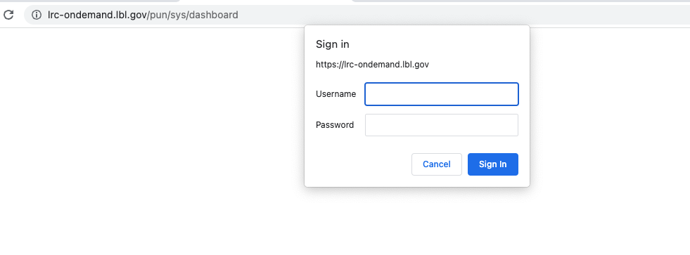

2.  Use your LRC username and PIN+one-time password (OTP)
        - Same creatials you use to login to Lawrencium 

---

### OOD Dashboard on Lawrencium
On successful authentication you will see a OOD dashboard. 

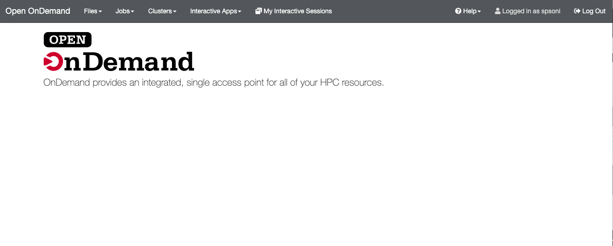

---
## Interactive Apps: Jupyter notebook
Click on Interactive apps --> Jupyter Server to open Jupyter notebook

---
Interactive mode

----
Compute mode

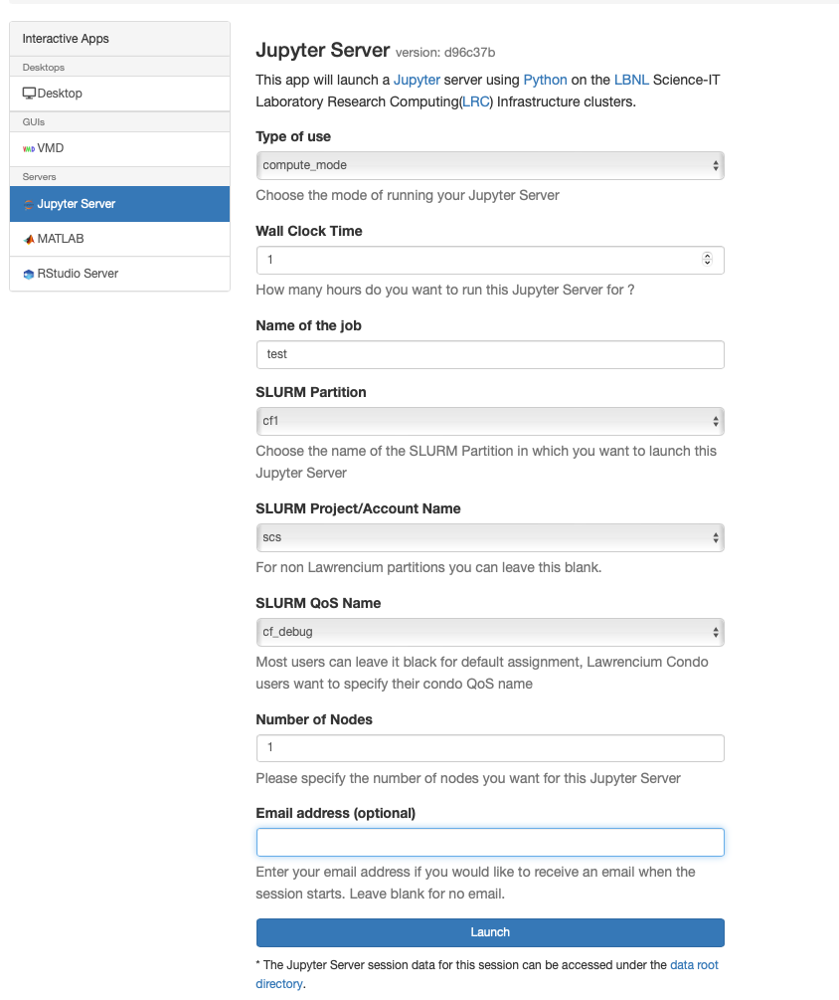 
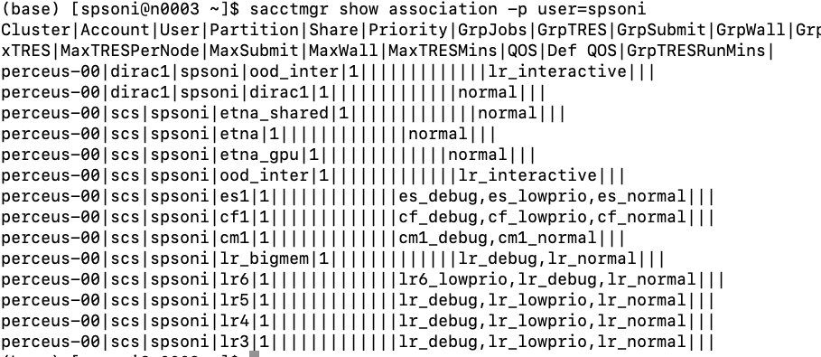

----
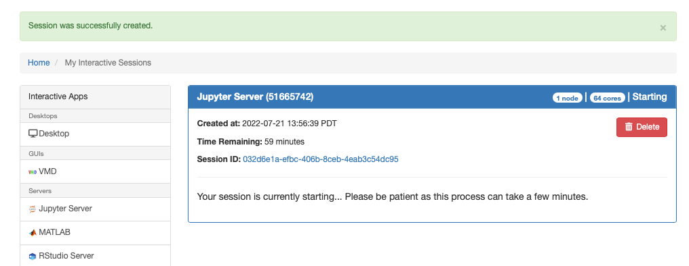

---
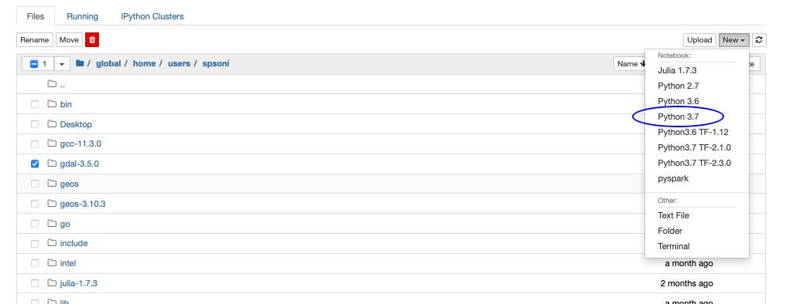
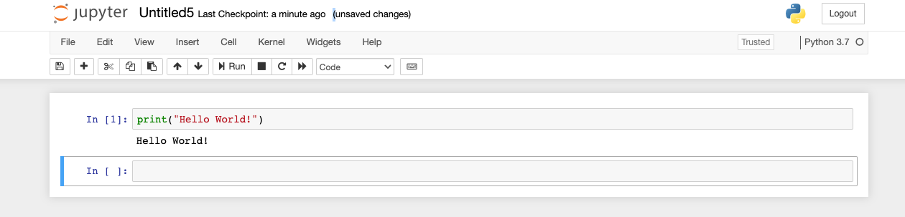

---
## Custom pyKernel
If you’d like to use a language or version of python or different conda environment not indicated in the drop-down menu of jupyter notebook you’ll need to create your own kernel.

**Two ways of customization:** 
1. Using a Conda environment
2. Manually creating a new kernel

[Click here for details.](https://it.lbl.gov/resource/hpc/for-users/hpc-documentation/open-ondemand/jupyter-server/)

---
## Interactive Apps: Rstudio

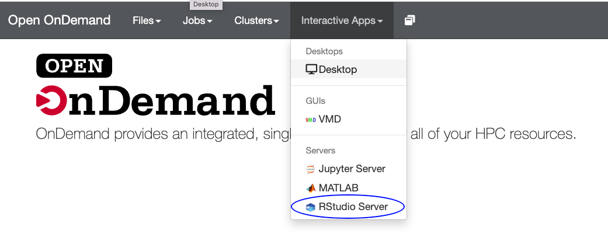

----

Compute and interactive mode 
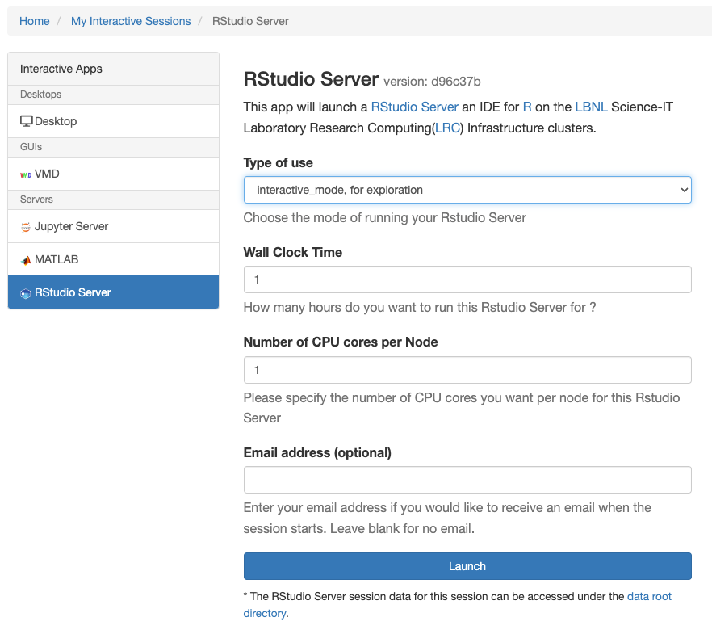
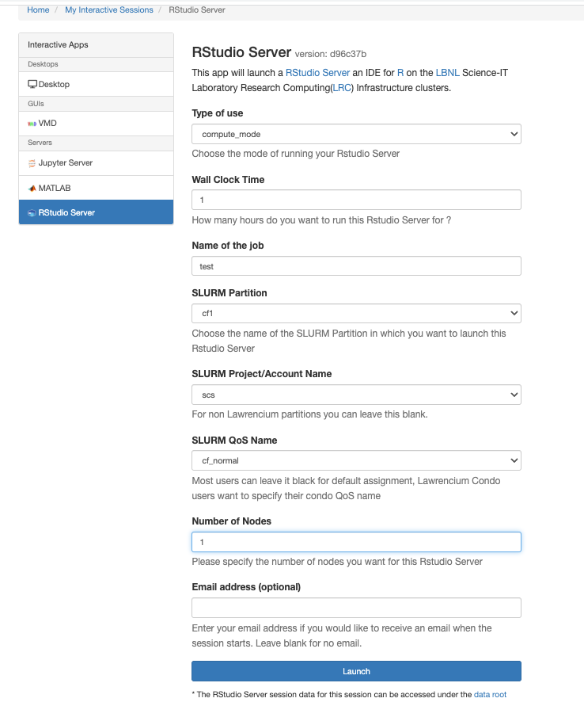

---
## Interactive Apps: Matlab
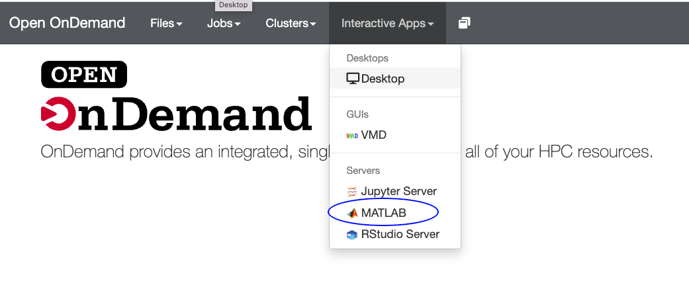

---
## Desktop 

---
### Using Desktop to launch VMD and ParaView

---

# File management

---

# Command-line shell access

---
# Job submission and management

---
