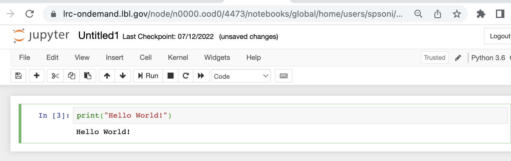
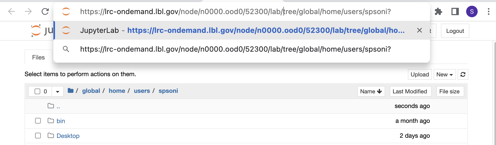

<style>section { font-size: 25px; }</style>

<!-- _class: lead -->
<!-- _paginate: false -->

# Open OnDemand on Lawrencium 
#### Sapana Soni


---

<style scoped>section { font-size: 28px; }</style>

<!-- paginate: true -->
# Outline
<style scoped>section { font-size: 26px; }</style>
1. [Introduction](#3)
2. [Accessing OOD on Lawrencium](#5)
3. [Interactive Apps: Jupyter Server, RStudio Server, MATLAB, Desktop](#7)
4. [Customizing Jupyter Kernels: Python and Julia](#13)
5. [Files: file management](#23)
6. [Clusters: LRC shell access](#25)
7. [Jobs: job management and submission](#26)

---
## Training style : mostly demonstration

- If you have account on Lawrencium then open OOD dashboard and try it yourself as we go. 
- Don't have account on Lawrencium? Don't worry! You can watch for now and try it later using training materail. 
- Training material is available on GitHub(https://github.com/lbnl-science-it/OOD_training_july2022.git/.)
- Recording for the training will be available in the same GitHub repository. 
- How to use Lawrencium? 
  - One [click](https://it.lbl.gov/resource/hpc/for-users/hpc-documentation/) to the documentationnpm install -g markdown-it 
----

<style scoped>section { font-size: 24px; }</style>

# Introduction 
- What is Open OnDemand?
   - OpenOnDemand is a web platform that provides an easy access to the cluster’s HPC resourses and services.  
   - Designed and developed by Ohio Supercomputer Center.
- Why OOD?
  - **New users:** intuitive and easy access to computing resourses, removes barrier in using HPC resourses for their research. 
  - **Advanced users:** alternative and convenient way to traditional command line access
  


---
<!-- _class: lead -->

<style>
footer { font-size: 20px
    }
</style>

<style scoped>section { font-size: 24px; }</style>

- How OOD works at system level? 
<style>
img[alt~="center"] {
  display: block;
  margin: 0 auto;
}
</style>


Users are able to use HPC services more efficiently through Open OnDemand. 

---

# Accessing OOD on Lawrencium

<style scoped>section { font-size: 25px; }</style>

 1. Web link to connect : [https://lrc-ondemand.lbl.gov/](https://lrc-ondemand.lbl.gov/)
**Note:** Use Chrome or Firefox to browse this page. Safari has known [authentication issues](https://osc.github.io/ood-documentation/master/issue/overview.html).


2.  Use your LRC username and PIN+one-time password (OTP)
    - same credentials you use to login Lawrencium cluster


---

### OOD Dashboard on Lawrencium
On successful authentication you will see a OOD dashboard. 


---
## Interactive Apps: Jupyter server
Click on **Interactive apps --> Jupyter Server** to open Jupyter notebook


---

Interactive mode


----

Compute mode

 


----


---



---
To load Jupyter lab simply add **lab/** before **tree/** in jupyter server url.




---
## Customizing Jupyter Kernels : Python and Julia
If you’d like to use a different language or version of python or different conda environment not indicated in the drop-down menu of jupyter notebook you’ll need to create your own kernel.

### **Python:**
There are two ways to add python kernel to jupyter notebook. 
1. Using conda environment
2. Manually creating a new kernel
   [Click here for details.](https://it.lbl.gov/resource/hpc/for-users/hpc-documentation/open-ondemand/jupyter-server/)
   
---
Customizing python kernel using conda environment

```
# Creating a pykernel for 3.9.12 version of python and installing packages
module load python/3.9.12
# Create the environment in your home directory: 
conda create --name=py39 python=3.9 ipykernel
source activate py39
python -m ipykernel install --user --name py39 --display-name="py39(Sci)"
conda install -c conda-forge scipy
```
Creating environment in scratch space: $USER is your own username.
```
conda create -p /global/scratch/users/$USER/py39_scr python=3.9 ipykernel
source activate /global/scratch/users/$USER/py39_scr
python -m ipykernel install --name=py39_scr --prefix=/global/scratch/users/$USER/py39_scr --display-name="py39_scratch"
#create sysmlink to kernel in custom path
ln -s /global/scratch/users/$USER/py39 /global/home/users/$USER/.local/share/jupyter/kernels/py39
```
You need to create a symlink in /global/home/users/$USER/.local/share/jupyter/kernels/ directory so that kernel appears in the jupyter notebook.


---
### **Julia:**
Julia kernel can be added in Jupyter for writing a Julia code in Jupyter notebook. To add a Julia kernel to Jupyter we only need to add the IJulia package.

```
module load julia/1.0.3
julia --version
julia
using Pkg
Pkg.add("IJulia")
Pkg.build("IJulia")
```

To remove unwanted jupyter kernel use following commands.

```
module load python/3.9.12
jupyter kernelspec list
jupyter kernelspec uninstall julia-1.0
jupyter kernelspec uninstall py39
```


---
## Interactive Apps: RStudio


----

Compute and interactive mode 


---
## Interactive Apps: MATLAB


---
##  Interactive Apps: Desktop 


---

## Desktop  


---
### Using Desktop to launch VMD 


---
### Using Desktop to launch ParaView


---
# Files: file management
- **Conventional approach: command line**
  - Linux file editors for editing files: vi, vim, nano, emacs
  - File transfer: scp, rsync
- **Globus for file transfer**
- **Open OnDemand: Files feature**
  - view and edit text files
  - create or rename or delete files
  - create or rename or delete directories
  - file/directory upload and download
  

---

### Files : Home directory  


---

# Clusters: LRC shell access


---
# Job submission and management


---
# Job composer and template


---
### Submission script 


---
# Jobs:  submission directory

Job composer creates a working directory by default on the path /global/home/users/spsoni/ondemand/data/sys/myjobs/projects/default
-  **Use default path:** Copy/upload all the files required for the jobs on this path before hitting Subimit button.
   -  click 'Open Dir' button at the bottom of the job script content.
   -  using a file explorer upload or transfer files


  


---
**OR**

- **Set different working directory:** If you want to use files saved on different location and would like to run job in that diectory, for example: scratch.
  - add following command line in your job script
  ````
  cd /global/scratch/users/spsoni/my_working_dir
  ````
  **Note:** Use path you aim to set for your working directory. 
---

# Log out and clean up
- Log out of the portal

- Clean up
  - The portal stores temporary files for interactive apps on the path $HOME//ondemand/data/sys/dashboard/batch_connect/sys
  - It is a good practice to clean up this directory periodically.
  ```
  rm -rf $HOME/ondemand/data/sys/dashboard/batch_connect/sys/* 
  ```

---

  # Getting help
  - Virtual office hours: 
    - Time: 10.30 am to noon every Wednesday
    - Online [request](https://docs.google.com/forms/d/e/1FAIpQLScBbNcr0CbhWs8oyrQ0pKLmLObQMFmYseHtrvyLfOAoIInyVA/viewform)
  - Send us tickets at hpcshelp@lbl.gov
  - More information about LBNL Supercluster and scientic computing services can be found [here](https://it.lbl.gov/service/scienceit/). 

Your feedback is important to us for improving HPC services and training.
Please fill out [training survey](https://docs.google.com/forms/d/1PrqmX6Y0ZO88w2_cV1LerOIkNqo8oalWhxw3lzyz3mw/edit)


---